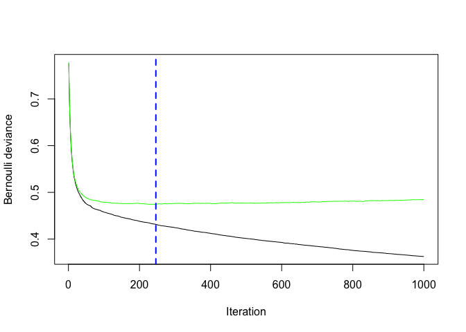

Online Shoppers Intention classification using Boosting
================
Nicola Disabato
2022-08-01

## Importing libraries

``` r
library(magrittr) 
library(dplyr)
```

    ## 
    ## Caricamento pacchetto: 'dplyr'

    ## I seguenti oggetti sono mascherati da 'package:stats':
    ## 
    ##     filter, lag

    ## I seguenti oggetti sono mascherati da 'package:base':
    ## 
    ##     intersect, setdiff, setequal, union

``` r
library(caret)
```

    ## Caricamento del pacchetto richiesto: ggplot2

    ## Caricamento del pacchetto richiesto: lattice

``` r
library(fastAdaboost)
library(Matrix)
library(ROCR)
library(pROC)
```

    ## Type 'citation("pROC")' for a citation.

    ## 
    ## Caricamento pacchetto: 'pROC'

    ## I seguenti oggetti sono mascherati da 'package:stats':
    ## 
    ##     cov, smooth, var

``` r
library(xgboost)
```

    ## 
    ## Caricamento pacchetto: 'xgboost'

    ## Il seguente oggetto è mascherato da 'package:dplyr':
    ## 
    ##     slice

``` r
library(gbm)
```

    ## Loaded gbm 2.1.8

## Importing the dataset

``` r
# Load the dataset and explore
intentions <- read.csv("online_shoppers_intention.csv", header = TRUE) 
str(intentions)
```

    ## 'data.frame':    12330 obs. of  18 variables:
    ##  $ Administrative         : int  0 0 0 0 0 0 0 1 0 0 ...
    ##  $ Administrative_Duration: num  0 0 0 0 0 0 0 0 0 0 ...
    ##  $ Informational          : int  0 0 0 0 0 0 0 0 0 0 ...
    ##  $ Informational_Duration : num  0 0 0 0 0 0 0 0 0 0 ...
    ##  $ ProductRelated         : int  1 2 1 2 10 19 1 0 2 3 ...
    ##  $ ProductRelated_Duration: num  0 64 0 2.67 627.5 ...
    ##  $ BounceRates            : num  0.2 0 0.2 0.05 0.02 ...
    ##  $ ExitRates              : num  0.2 0.1 0.2 0.14 0.05 ...
    ##  $ PageValues             : num  0 0 0 0 0 0 0 0 0 0 ...
    ##  $ SpecialDay             : num  0 0 0 0 0 0 0.4 0 0.8 0.4 ...
    ##  $ Month                  : chr  "Feb" "Feb" "Feb" "Feb" ...
    ##  $ OperatingSystems       : int  1 2 4 3 3 2 2 1 2 2 ...
    ##  $ Browser                : int  1 2 1 2 3 2 4 2 2 4 ...
    ##  $ Region                 : int  1 1 9 2 1 1 3 1 2 1 ...
    ##  $ TrafficType            : int  1 2 3 4 4 3 3 5 3 2 ...
    ##  $ VisitorType            : chr  "Returning_Visitor" "Returning_Visitor" "Returning_Visitor" "Returning_Visitor" ...
    ##  $ Weekend                : logi  FALSE FALSE FALSE FALSE TRUE FALSE ...
    ##  $ Revenue                : logi  FALSE FALSE FALSE FALSE FALSE FALSE ...

``` r
table(intentions$Revenue)
```

    ## 
    ## FALSE  TRUE 
    ## 10422  1908

As you can see, the dataset is made up of 12330 instances and 18
features. Of these observations, only 1908 are users who have finalized
a purchase.

All details can be found through the following link:
<https://archive.ics.uci.edu/ml/datasets/Online+Shoppers+Purchasing+Intention+Dataset#>

## Data Preparation

``` r
intentions <- intentions %>% 
  mutate(OperatingSystems = as.factor(OperatingSystems),
         Browser = as.factor(Browser),
         Region = as.factor(Region),
         TrafficType = as.factor(TrafficType),
         VisitorType = as.factor(VisitorType),
         Month = as.factor(Month)
         )

intentions <- intentions %>% 
  mutate(
         Weekend = as.numeric(Weekend),
         Revenue = as.numeric(Revenue)
         )

str(intentions)
```

    ## 'data.frame':    12330 obs. of  18 variables:
    ##  $ Administrative         : int  0 0 0 0 0 0 0 1 0 0 ...
    ##  $ Administrative_Duration: num  0 0 0 0 0 0 0 0 0 0 ...
    ##  $ Informational          : int  0 0 0 0 0 0 0 0 0 0 ...
    ##  $ Informational_Duration : num  0 0 0 0 0 0 0 0 0 0 ...
    ##  $ ProductRelated         : int  1 2 1 2 10 19 1 0 2 3 ...
    ##  $ ProductRelated_Duration: num  0 64 0 2.67 627.5 ...
    ##  $ BounceRates            : num  0.2 0 0.2 0.05 0.02 ...
    ##  $ ExitRates              : num  0.2 0.1 0.2 0.14 0.05 ...
    ##  $ PageValues             : num  0 0 0 0 0 0 0 0 0 0 ...
    ##  $ SpecialDay             : num  0 0 0 0 0 0 0.4 0 0.8 0.4 ...
    ##  $ Month                  : Factor w/ 10 levels "Aug","Dec","Feb",..: 3 3 3 3 3 3 3 3 3 3 ...
    ##  $ OperatingSystems       : Factor w/ 8 levels "1","2","3","4",..: 1 2 4 3 3 2 2 1 2 2 ...
    ##  $ Browser                : Factor w/ 13 levels "1","2","3","4",..: 1 2 1 2 3 2 4 2 2 4 ...
    ##  $ Region                 : Factor w/ 9 levels "1","2","3","4",..: 1 1 9 2 1 1 3 1 2 1 ...
    ##  $ TrafficType            : Factor w/ 20 levels "1","2","3","4",..: 1 2 3 4 4 3 3 5 3 2 ...
    ##  $ VisitorType            : Factor w/ 3 levels "New_Visitor",..: 3 3 3 3 3 3 3 3 3 3 ...
    ##  $ Weekend                : num  0 0 0 0 1 0 0 1 0 0 ...
    ##  $ Revenue                : num  0 0 0 0 0 0 0 0 0 0 ...

We use one-hot encoding for categorical variables.

``` r
dmy <- dummyVars(" ~ .", data = intentions)
intentions <- data.frame(predict(dmy, newdata = intentions))

dim(intentions)
```

    ## [1] 12330    75

After the preprocessing phase, we obtain a dataset with 75 features.

## Train and Test partition

``` r
set.seed(100)
inTrain <- createDataPartition(y = intentions$Revenue, p = .75, list = FALSE)
train <- intentions[ inTrain,] 
test <- intentions[-inTrain,]

X_train <- sparse.model.matrix(Revenue ~ .-1, data = train)
y_train <- train[,"Revenue"]  
X_test <- sparse.model.matrix(Revenue~.-1, data = test)
y_test <- test[,"Revenue"]
```

## Let’s explore AdaBoost model

``` r
model_adaboost <- adaboost(Revenue ~ ., data=train, nIter=10)
model_adaboost
```

    ## adaboost(formula = Revenue ~ ., data = train, nIter = 10)
    ## Revenue ~ .
    ## Dependent Variable: Revenue
    ## No of trees:10
    ## The weights of the trees are:1.3226071.1136721.0410931.0339541.0131450.95893290.92418360.92972750.90278420.8971979

After training the model on the train dataset, you can use the predict
() method to predict the output of the Revenue class in the test
dataset. To analyze the performance of the model, it was decided to
print the confusion matrix in addition to the precision, recall and
f1-score metrics, in addition to the accuracy metric.

``` r
#predictions
pred_ada = predict(model_adaboost, newdata=test)

#confusion matrix creation
cm = confusionMatrix(as.factor(pred_ada$class),as.factor(y_test), positive = '1')
cm
```

    ## Confusion Matrix and Statistics
    ## 
    ##           Reference
    ## Prediction    0    1
    ##          0 2431  204
    ##          1  141  306
    ##                                          
    ##                Accuracy : 0.8881         
    ##                  95% CI : (0.8764, 0.899)
    ##     No Information Rate : 0.8345         
    ##     P-Value [Acc > NIR] : < 2.2e-16      
    ##                                          
    ##                   Kappa : 0.5736         
    ##                                          
    ##  Mcnemar's Test P-Value : 0.0008439      
    ##                                          
    ##             Sensitivity : 0.60000        
    ##             Specificity : 0.94518        
    ##          Pos Pred Value : 0.68456        
    ##          Neg Pred Value : 0.92258        
    ##              Prevalence : 0.16548        
    ##          Detection Rate : 0.09929        
    ##    Detection Prevalence : 0.14504        
    ##       Balanced Accuracy : 0.77259        
    ##                                          
    ##        'Positive' Class : 1              
    ## 

``` r
print(cm$byClass[5])
```

    ## Precision 
    ## 0.6845638

``` r
print(cm$byClass[6])
```

    ## Recall 
    ##    0.6

``` r
print(cm$byClass[7])
```

    ##        F1 
    ## 0.6394984

It is immediately evident how the classification model, despite having
an accuracy value of 0.88, is found to be not very precise as the values
of Precision, Recall and F1 are quite low. This often happens in these
cases, that is with the presence of unbalanced classes: in such cases
the accuracy metric is not very informative.

To build the best possible Adaboost model, depending on the dataset, we
have chosen to build a graph from which to display the best number of
decision trees (of iterations) to specify to build a more precise model,
based on the errors made.

``` r
best_adaboost <- adaboost(Revenue ~ ., data=train, nIter=125)

#predictions
pred_best_ada = predict(best_adaboost, newdata=test)

#confusion matrix creation
cm <- confusionMatrix(as.factor(pred_best_ada$class),as.factor(y_test), positive = '1')
cm
```

    ## Confusion Matrix and Statistics
    ## 
    ##           Reference
    ## Prediction    0    1
    ##          0 2474  209
    ##          1   98  301
    ##                                           
    ##                Accuracy : 0.9004          
    ##                  95% CI : (0.8893, 0.9107)
    ##     No Information Rate : 0.8345          
    ##     P-Value [Acc > NIR] : < 2.2e-16       
    ##                                           
    ##                   Kappa : 0.6049          
    ##                                           
    ##  Mcnemar's Test P-Value : 3.429e-10       
    ##                                           
    ##             Sensitivity : 0.59020         
    ##             Specificity : 0.96190         
    ##          Pos Pred Value : 0.75439         
    ##          Neg Pred Value : 0.92210         
    ##              Prevalence : 0.16548         
    ##          Detection Rate : 0.09766         
    ##    Detection Prevalence : 0.12946         
    ##       Balanced Accuracy : 0.77605         
    ##                                           
    ##        'Positive' Class : 1               
    ## 

``` r
print(cm$byClass[5])
```

    ## Precision 
    ##  0.754386

``` r
print(cm$byClass[6])
```

    ##    Recall 
    ## 0.5901961

``` r
print(cm$byClass[7])
```

    ##        F1 
    ## 0.6622662

From the results it is possible to observe how better results have been
achieved, starting from the Precision metric which describes a greater
precision in the prediction of the positive label 1 which passes from
0.68 to 0.75. The other metrics remain similar.

## Gradient Boosting

Also in this case we started from a generic Gradient Boosting model,
selecting a large number of trees in such a way as to build a graph that
allows you to select a number of trees suitable for the train dataset,
through the gbm.perf () function .

To do this, cross-validation is used by selecting a fold number equal to
5.

``` r
set.seed(100)

# train GBM model
gbm.fit <- gbm(
  formula = train$Revenue ~ .,
  data = train,
  distribution = 'bernoulli',
  n.trees = 1000,
  interaction.depth = 2,
  shrinkage = 0.1,
  cv.folds = 5,
  verbose = F
  )  
```

    ## Warning in gbm.fit(x = x, y = y, offset = offset, distribution = distribution, :
    ## variable 67: TrafficType.17 has no variation.

``` r
best.iter = gbm.perf(gbm.fit, method="cv")
```

<!-- -->

It is possible to see from the graph the best number of iterations to
obtain a model with good performance without overfitting.

At this point, the Revenue label on the test data is estimated using the
best.iter parameter as the number of decision trees. It specifies that
the output defined by the logit function has a range of 0 to 1, so the y
label is expected to have a default cutoff value of 0.5. If the output
is greater than 0.5 it will be labeled as 1, otherwise as 0. To do this
we used the round () function.

``` r
test_pred = predict(object = gbm.fit,
                   newdata = test,
                   n.trees = best.iter,
                   type = "response")

test_pred <- as.numeric(test_pred > 0.5)

cm <- confusionMatrix(factor(test_pred), factor(y_test), positive = '1')
print(cm)
```

    ## Confusion Matrix and Statistics
    ## 
    ##           Reference
    ## Prediction    0    1
    ##          0 2477  198
    ##          1   95  312
    ##                                          
    ##                Accuracy : 0.9049         
    ##                  95% CI : (0.894, 0.9151)
    ##     No Information Rate : 0.8345         
    ##     P-Value [Acc > NIR] : < 2.2e-16      
    ##                                          
    ##                   Kappa : 0.6255         
    ##                                          
    ##  Mcnemar's Test P-Value : 2.539e-09      
    ##                                          
    ##             Sensitivity : 0.6118         
    ##             Specificity : 0.9631         
    ##          Pos Pred Value : 0.7666         
    ##          Neg Pred Value : 0.9260         
    ##              Prevalence : 0.1655         
    ##          Detection Rate : 0.1012         
    ##    Detection Prevalence : 0.1321         
    ##       Balanced Accuracy : 0.7874         
    ##                                          
    ##        'Positive' Class : 1              
    ## 

``` r
print(cm$byClass[5])
```

    ## Precision 
    ## 0.7665848

``` r
print(cm$byClass[6])
```

    ##    Recall 
    ## 0.6117647

``` r
print(cm$byClass[7])
```

    ##        F1 
    ## 0.6804798

The results obtained are comparable to those obtained by the Adaboost
algorithm, although slightly better for all metrics.

## XGBoost

After defining the parameters suitable for the classification problem,
the model with k-fold cross validation was used, in order to estimate
the best performance of the algorithm.

One of the special features of XGBoost is the ability to follow the
progress of learning after each round. Due to the way the boost works,
there is a time when having too many rounds leads to overfitting. The
following techniques will help avoid overfitting or optimize learning
time by stopping it as soon as possible.

One way to measure progress in learning a model is to provide XGBoost
with a second set of data that is already classified. Therefore he can
learn on the first dataset and test his model on the second.

``` r
set.seed(100)

xgb_train <- xgb.DMatrix(data = as.matrix(X_train), label = (y_train))
xgb_test <- xgb.DMatrix(data = as.matrix(X_test), label = (y_test))

param_list = list(booster = "gbtree", objective = "binary:logistic", eta=0.1, gamma=0, max_depth=4, subsample=1, colsample_bytree=1, eval_metric='error')

watchlist <- list(train=xgb_train, test=xgb_test)

xgbcv = xgb.cv(params = param_list,
            data = xgb_train,
            nrounds = 10000,
            nfold = 5,
            prediction = TRUE,   
            showsd = T, 
            stratified = T,
            print_every_n = 5,
            early_stopping_rounds = 50)
```

    ## [1]  train-error:0.097832+0.001574   test-error:0.103698+0.005909 
    ## Multiple eval metrics are present. Will use test_error for early stopping.
    ## Will train until test_error hasn't improved in 50 rounds.
    ## 
    ## [6]  train-error:0.090857+0.001543   test-error:0.100130+0.003226 
    ## [11] train-error:0.088506+0.001124   test-error:0.099372+0.003291 
    ## [16] train-error:0.086640+0.001471   test-error:0.099264+0.003952 
    ## [21] train-error:0.085883+0.001214   test-error:0.098616+0.003025 
    ## [26] train-error:0.084505+0.001226   test-error:0.098940+0.002770 
    ## [31] train-error:0.083234+0.001479   test-error:0.098616+0.003687 
    ## [36] train-error:0.081504+0.002142   test-error:0.098616+0.003098 
    ## [41] train-error:0.081261+0.001753   test-error:0.098399+0.002038 
    ## [46] train-error:0.080261+0.001831   test-error:0.097859+0.002412 
    ## [51] train-error:0.079774+0.001724   test-error:0.097318+0.002133 
    ## [56] train-error:0.078612+0.001593   test-error:0.097102+0.002364 
    ## [61] train-error:0.077882+0.001643   test-error:0.096345+0.002660 
    ## [66] train-error:0.076854+0.001670   test-error:0.096994+0.002667 
    ## [71] train-error:0.076206+0.001895   test-error:0.097859+0.002964 
    ## [76] train-error:0.074854+0.001839   test-error:0.098400+0.003194 
    ## [81] train-error:0.073692+0.001688   test-error:0.099373+0.002298 
    ## [86] train-error:0.072637+0.002126   test-error:0.099373+0.002493 
    ## [91] train-error:0.072259+0.002038   test-error:0.099048+0.001976 
    ## [96] train-error:0.071232+0.001836   test-error:0.099481+0.002072 
    ## [101]    train-error:0.069826+0.002251   test-error:0.098508+0.002351 
    ## [106]    train-error:0.069123+0.002364   test-error:0.098508+0.002229 
    ## Stopping. Best iteration:
    ## [60] train-error:0.078044+0.001669   test-error:0.096345+0.002660

The output shows the best number of iterations to perform to have a good
model performance without overfitting.

``` r
xgbcv_model = xgboost(data = xgb_train,
                    params = param_list,
                    nrounds = 60,
                    verbose=0)

#test
pred <- predict(xgbcv_model, xgb_test)
pred <- as.numeric(pred > 0.5)

#confusion matrix creation
cm <- confusionMatrix(as.factor(pred), as.factor(y_test), positive='1')
cm
```

    ## Confusion Matrix and Statistics
    ## 
    ##           Reference
    ## Prediction    0    1
    ##          0 2493  200
    ##          1   79  310
    ##                                           
    ##                Accuracy : 0.9095          
    ##                  95% CI : (0.8988, 0.9194)
    ##     No Information Rate : 0.8345          
    ##     P-Value [Acc > NIR] : < 2.2e-16       
    ##                                           
    ##                   Kappa : 0.6378          
    ##                                           
    ##  Mcnemar's Test P-Value : 6.76e-13        
    ##                                           
    ##             Sensitivity : 0.6078          
    ##             Specificity : 0.9693          
    ##          Pos Pred Value : 0.7969          
    ##          Neg Pred Value : 0.9257          
    ##              Prevalence : 0.1655          
    ##          Detection Rate : 0.1006          
    ##    Detection Prevalence : 0.1262          
    ##       Balanced Accuracy : 0.7886          
    ##                                           
    ##        'Positive' Class : 1               
    ## 

``` r
print(cm$byClass[5])
```

    ## Precision 
    ## 0.7969152

``` r
print(cm$byClass[6])
```

    ##    Recall 
    ## 0.6078431

``` r
print(cm$byClass[7])
```

    ##        F1 
    ## 0.6896552

The performances of the XGBoost model are the best both in terms of
metrics taken into consideration and in terms of execution time. In
fact, the Precision metric that indicates when the model predicts the
positive class well (i.e. in this case the class with the fewest
instances) is greater than the other Boosting algorithms, reaching the
value 0.79.

## Conclusion

We analyzed a dataset to perform a binary classification on it through
the use of the various boosting techniques present in the literature. We
can say, through the results obtained, that these techniques have
proved, although costly at a computational level, quite accurate in the
classification task, based on different metrics suitable for the problem
in question. To obtain even more performing models, a search for the
most suitable parameters was carried out through the cross-validation
technique, such as the depth of the trees, the learning rate and the
number of iterations.
